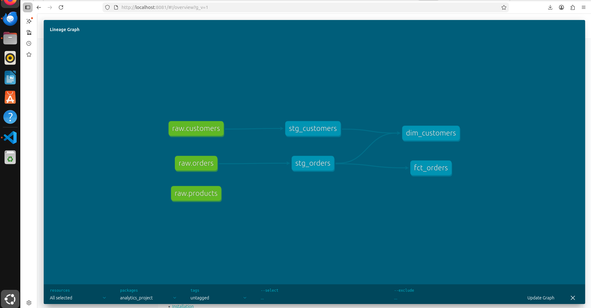

# GreenThread Analytics Suite (dbt + PostgreSQL)

## dbt Lineage (DAG)




## What this is
A small analytics engineering project using **dbt**, **PostgreSQL**, and **Docker**.  
It turns raw e-commerce data into clean models for reporting.

## Models
### Staging
- `stg_customers` (cleans customer data)
- `stg_orders` (converts cents to USD)

### Marts
- `dim_customers`
  - first order date
  - number of orders
  - lifetime value
  - customer segment (VIP / High Value / Standard)
- `fct_orders`
  - flags potential revenue leaks (`completed` orders with $0 amount)

## Run it
```bash
docker-compose up -d postgres
docker-compose run --rm dbt run --project-dir analytics_project --profiles-dir .
docker-compose run --rm dbt test --project-dir analytics_project --profiles-dir .


If 8080 is busy, run with -p 8081:8080 and open http://localhost:8081
